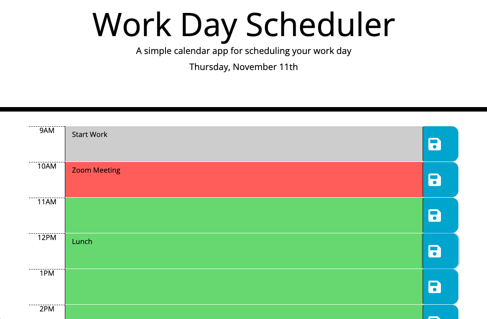

# Splendid Schedule

Splendid Schedule is a web application that allows daily planning. The current day is displayed at the top. Each hour from 9 AM to 5PM has a space available to enter text. After entering the event, click the save icon on the right to save your events to your local storage so they persist any time you open up the page again.

I built this with HTML, JavaScript, jQuery, Moment.js, CSS, Bootstrap, Font Awesome and Google Fonts. Classes are added and removed dynamically as the day progresses to render three different colors to indicate if the events are in the past, present, or future. If the page is inactive, the colors will update every 15 minutes.

Please submit an issue if you see a bug or a suggested improvement.

## Deployment

https://josh2100.github.io/splendid-schedule/

## Screenshot

